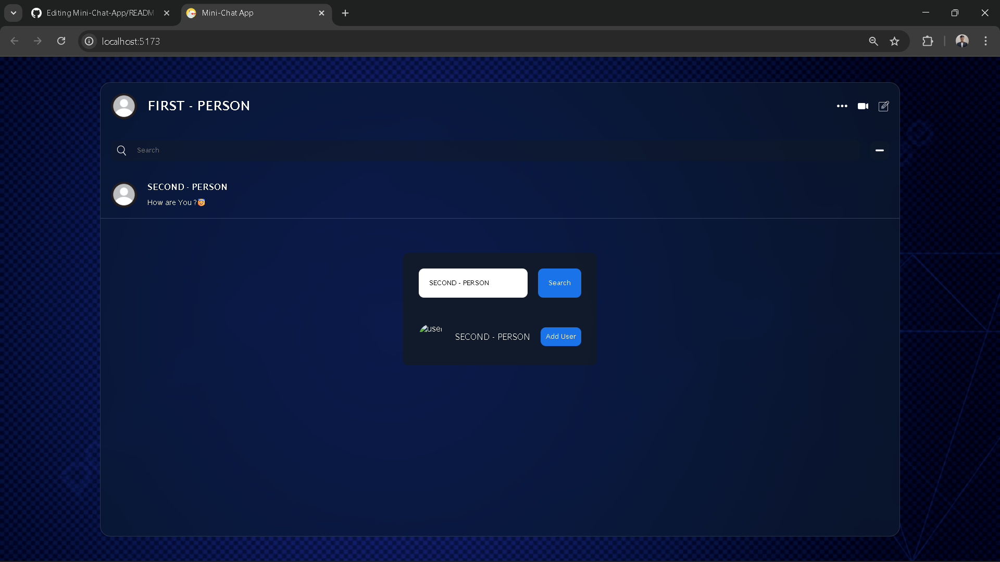

# 💬 Mini-Chat-App

A **Real-Time Chat Application** built with **Node.js, Express, and Socket.io**, featuring user authentication, responsive UI, and instant messaging.  
Designed as a lightweight yet functional project to demonstrate **Full-Stack Web Development Skills** and an understanding of **Real-Time Communication** systems.

---

### 🔹 Authentication
- **Registration**: Secure account creation with validation.
- **Login**: User-friendly login system with authentication checks.

### 🔹 Chat Interface
- **Main Chat Window**: Real-time messaging with multiple users.
- **Active Users List**: See who’s online instantly.

## 📸 Preview / Screenshots

### 🔐 Create Account / Login Page
The secure entry point where users can register or log in.


### 👤 Add User Page
A simple interface to add new users into the chat system.



### 💬 Main Interface Page
The core real-time chat window where users exchange messages.


---

## 📑 Table of Contents
- [About](#about)
- [Features](#features)
- [Tech Stack](#tech-stack)
- [Getting Started](#getting-started)
  - [Prerequisites](#prerequisites)
  - [Installation](#installation)
  - [Running Locally](#running-locally)
- [Usage](#usage)
- [Learning Outcomes](#learning-outcomes)
- [Contributing](#contributing)
- [License](#license)
- [Acknowledgements](#acknowledgements)

---

## 🧾 About
**Mini-Chat-App** is a Full-Stack Web application that enables users to connect, register, and communicate instantly.  
It’s designed with a focus on **scalability, clean code practices, and real-time interactivity**, making it an ideal showcase of **backend + frontend integration skills**.

---

## ✨ Features
- 🔐 **User Authentication** — Secure registration & login system.
- ⚡ **Real-Time Messaging** — Instant updates powered by **Socket.io**.
- 📱 **Responsive UI** — Smooth experience across desktop & mobile.
- 👥 **Active Users Display** — Track online participants in real-time.
- 🛠️ **Lightweight Setup** — Minimal dependencies for quick deployment.
- 🧹 **Clean Codebase** — ESLint configured for maintainability.

---

## 🛠️ Tech Stack
**Frontend**: HTML5, CSS3, JavaScript  
**Backend**: Node.js, Express.js  
**Real-Time Communication**: Socket.io  
**Tooling**: Vite, ESLint  
**Package Manager**: npm  

---

## 🚀 Getting Started

### ✅ Prerequisites
Make sure you have installed:
- [Node.js (v16+)](https://nodejs.org/)
- npm (comes with Node.js)

### 📦 Installation
Clone the repository and install dependencies:

```bash
git clone https://github.com/OmkarYelsange/Mini-Chat-App
cd Mini-Chat-App
npm install
```
▶️ Running Locally
Start the development server:

```bash
npm run dev
```

🎮 Usage
1. Open the application in your browser.
2. Create an account or log in with existing credentials.
3. Add User or Search for Existing One.
4. Start messaging in real-time with other connected users.
5. Logout when done.

🎓 Learning Outcomes
- Through this project, I gained hands-on experience with:
- Building real-time applications using Socket.io.
- Implementing authentication systems with Node.js.
- Creating a responsive frontend connected to a backend.
- Working with modern tooling like Vite & ESLint.
- Structuring full-stack projects for scalability and maintainability.

🤝 Contributing
Contributions are welcome!
To contribute:

1. Fork the repo.
2. Create a feature branch (git checkout -b feature/new-feature).
3. Commit your changes (git commit -m 'feat: Add new feature').
4. Push to your branch (git push origin feature/new-feature).
5. Open a Pull Request.

📜 License
This project is licensed under the MIT License.

- Acknowledgements
- Node.js - Backend runtime
- Express.js - Web framework
- Socket.io - Real-time communication
- Vite - Build tool
- ESLint - Code linting

✨ This project highlights my ability to build real-time, full-stack web applications — an essential skill set for modern software development roles.

